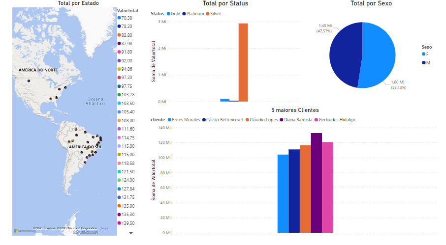
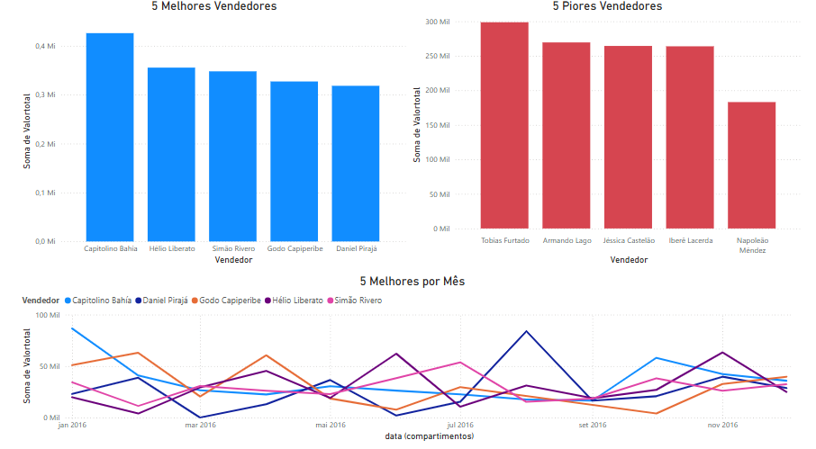
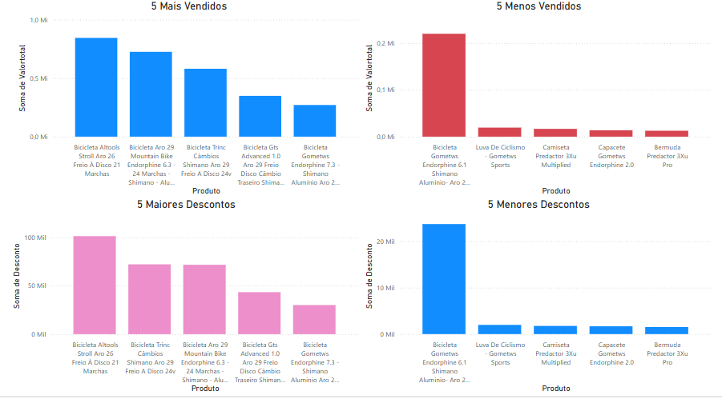
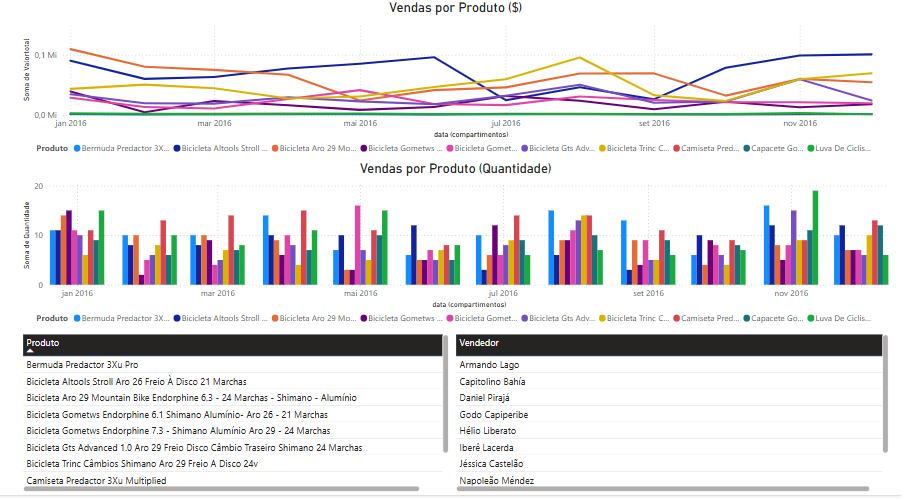

<h1>📊 Dashboard de Vendas - BikeWorld</h1>

A <strong>BikeWorld</strong> é uma empresa brasileira que nasceu da paixão por pedalar. Fundada por dois amigos ciclistas, ela rapidamente se tornou referência na venda de bicicletas e acessórios esportivos, atendendo clientes em todo o país.

Com o crescimento acelerado, surgiram dúvidas estratégicas fundamentais:

<ul>
  <li>Quem são nossos clientes mais valiosos?</li>
  <li>Qual vendedor está realmente performando?</li>
  <li>Quais produtos devem ser priorizados em campanhas?</li>
  <li>Existe sazonalidade no nosso faturamento?</li>
</ul>

Para responder a essas perguntas, foi desenvolvido um <strong>dashboard interativo</strong> usando Power BI, consolidando dados de vendas, clientes, produtos e performance comercial. Todos os dados foram organizados e extraídos a partir de um banco de dados <strong>PostgreSQL</strong>, garantindo robustez e confiabilidade nas análises.

<section>
  <h2>👥 Quem são nossos clientes?</h2>
  
  
O dashboard mostra que clientes com status <strong>Silver</strong> geram a maior parte da receita da BikeWorld. Isso sugere que o foco em fidelização vale a pena. A distribuição de gênero é quase igual, com leve predominância masculina. <strong>Diana Baptista</strong> aparece como a principal compradora, sendo um ótimo exemplo de cliente premium. Geograficamente, os clientes estão concentrados nas regiões Sul e Sudeste, indicando um potencial para expansão em outras regiões.

</section>

<section>
  <h2>🧑‍💼 Quais vendedores estão se destacando?</h2>
  
  
O vendedor <strong>Capitolino Bahia</strong> é o destaque absoluto em performance, liderando em volume de vendas mês após mês. Já <strong>Tobias Furtado</strong> tem desempenho inferior, o que pode indicar necessidade de treinamento ou realocação de tarefas. Observando os meses, percebemos uma clara sazonalidade, com picos de vendas concentrados em junho e novembro. Isso indica oportunidades para campanhas promocionais bem posicionadas.

</section>

<section>
  <h2>🚲 Quais produtos mais vendem?</h2>
  
  
A <strong>Bicicleta Altools Stroll Aro 26</strong> lidera as vendas, combinando preço competitivo e promoções frequentes. Produtos com maior desconto tendem a ter melhor desempenho, evidenciando a sensibilidade do cliente ao preço. Em contraste, modelos como a <strong>Gometws Endorphine 6.1</strong>, com preço elevado e poucos descontos, tiveram menor saída. Essas informações orientam tanto o planejamento do mix de produtos quanto a precificação.

</section>

<section>
  <h2>📈 Quando mais vendemos?</h2>
  
  
A curva de vendas revela picos nos meses de <strong>junho e julho</strong>, coincidindo com campanhas sazonais e maior procura por atividades ao ar livre no inverno. Produtos com ticket médio mais alto se mantêm estáveis ao longo do ano, enquanto itens mais acessíveis são mais sensíveis à sazonalidade. Isso permite à BikeWorld planejar estoques e campanhas de maneira estratégica.

</section>

📝 Com este dashboard, a BikeWorld passou a tomar decisões mais assertivas, baseadas em dados. Ele se tornou uma ferramenta essencial para o planejamento comercial, marketing e gestão de estoque. Um pedal mais seguro rumo ao crescimento 🚴‍♂️.

</body>
</html>
